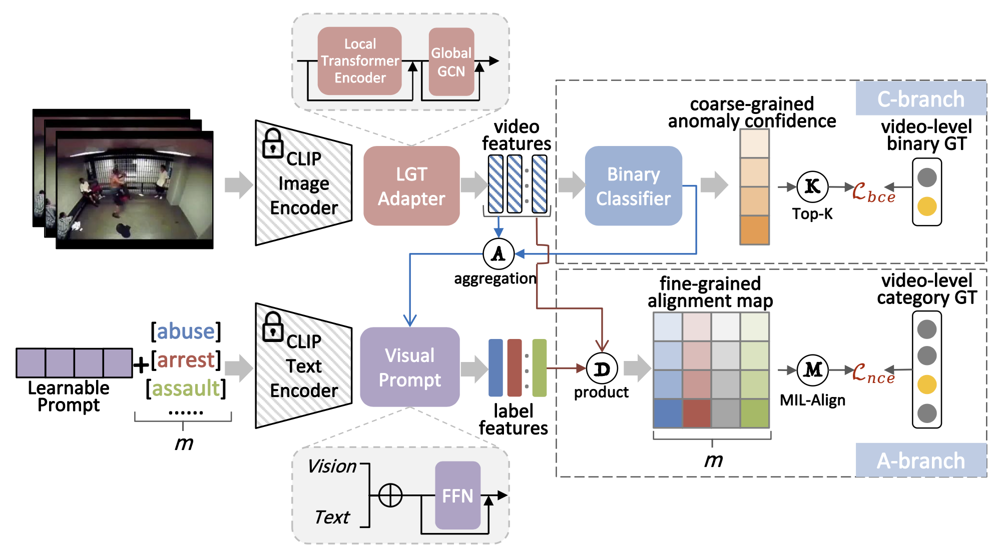

# Hurdle-TracePoint

PyTorch implementation of **Hurdle-TracePoint: Presence-Gated Event Scoring for Weakly Supervised Video Anomaly Detection**.

Hurdle-TracePoint learns temporal anomaly scores from video-level labels. It adds an event branch to [VadCLIP](https://github.com/nwpu-zxr/VadCLIP): the branch estimates whether an anomaly is present in a video, then uses that estimate to weight candidate events before combining them into a score over time.



## How it works

The event branch has three main steps:

1. **Estimate presence.** Pool features from the complete video to estimate whether any anomaly, and each anomaly class, occurs.
2. **Score event candidates.** A gated recurrent unit (GRU) summarizes the visual prefix: the features up to each possible start time. The branch uses this representation to score candidates defined by their start, class, and duration.
3. **Build temporal scores.** Scale candidate weights by the presence estimates, then combine overlapping intervals into class-specific coverage and an overall event score. In the figure, $\mathcal{A}(u)$ contains the start–duration pairs covering snippet $u$.

The event branch shares CLIP features and class-text information with the VadCLIP frame detector. Each branch produces its own scores, and event losses update only the event branch. Presence estimation uses the complete video, so inference is offline.

The event model is in [src/tracepoint.py](src/tracepoint.py), and its connection to VadCLIP is in [src/model.py](src/model.py).

## Installation

Use Python 3.10 or newer. A CUDA-capable GPU is recommended for training.

```bash
git clone https://github.com/SVIL2024/Hurdle-TracePoint.git
cd Hurdle-TracePoint
python3 -m venv .venv
source .venv/bin/activate
```

Install a compatible PyTorch and torchvision build, together with NumPy, SciPy,
scikit-learn, pandas, tqdm, Pillow, OpenCV, and pytest. Choose the PyTorch build
for your hardware using the [PyTorch installation guide](https://pytorch.org/get-started/locally/). The CLIP implementation downloads its pretrained weights on first use.

All commands below run from the repository root.

## Data and checkpoints

| Resource | Download | Access code |
|---|---|---|
| Dataset package | [Quark Drive](https://pan.quark.cn/s/b57edbb83bd4) | `TwtL` |
| UCF-Crime and XD-Violence checkpoints | [Quark Drive](https://pan.quark.cn/s/72cde99ab1a9) | `xbCF` |

### Feature lists

The scripts read pre-extracted CLIP ViT-B/16 features. Each `.npy` file contains a `float32` array of shape `(T, 512)`, where `T` is the number of snippets, or short groups of consecutive frames. Evaluation assumes 16 video frames per snippet.

Create training and test CSV files with two columns, `path` and `label`. Paths can be absolute or relative to the repository root.

UCF-Crime example:

```csv
path,label
features/ucf/normal_001.npy,Normal
features/ucf/abuse_001.npy,Abuse
```

UCF-Crime labels use the names in the [training script's label map](src/ucf_train.py), including the capitalized normal label `Normal`.

XD-Violence example:

```csv
path,label
features/xd/normal_001.npy,A
features/xd/fighting_001.npy,B1
features/xd/multiple_001.npy,B1-B2
```

XD-Violence uses `A` for normal videos, `B1` for fighting, `B2` for shooting, `B4` for riot, `B5` for abuse, `B6` for car accident, and `G` for explosion. Join multiple anomaly labels with `-`, as in `B1-B2`.

### File locations

By default, the following files are read from `list/`:

| Input | UCF-Crime | XD-Violence |
|---|---|---|
| Training CSV | `ucf_CLIP_rgb.csv` | `xd_CLIP_rgb.csv` |
| Test CSV | `ucf_CLIP_rgbtest.csv` | `xd_CLIP_rgbtest.csv` |
| Frame labels | `gt_ucf.npy` | `gt.npy` |
| Temporal intervals | `gt_segment_ucf.npy` | `gt_segment.npy` |
| Interval class labels | `gt_label_ucf.npy` | `gt_label.npy` |

Keep test videos in the same order as the annotation arrays. Frame labels follow the concatenated test-video order; interval and class-label arrays have corresponding entries for each video. The training scripts also load these annotations for checkpoint evaluation.

For other locations, use `--train-list`, `--test-list`, `--gt-path`, `--gt-segment-path`, and `--gt-label-path`.

## Training

The following commands use the paper's main event configuration: both presence gates, seven duration choices, and a visual prefix without feedback from earlier event predictions.

UCF-Crime:

```bash
python src/ucf_train.py \
  --tracepoint --tracepoint-hurdle-gate --tracepoint-no-history \
  --output-dir outputs/ucf_hurdle
```

XD-Violence:

```bash
python src/xd_train.py \
  --tracepoint --tracepoint-hurdle-gate --tracepoint-no-history \
  --output-dir outputs/xd_hurdle
```

| Option | Purpose |
|---|---|
| `--tracepoint` | Enable the event branch alongside VadCLIP. |
| `--tracepoint-hurdle-gate` | Enable global and class-specific presence gates. |
| `--tracepoint-no-history` | Use the visual prefix without recurrent feedback from previous event candidates. |

The default duration choices are `1, 2, 4, 8, 16, 32, 64`. At test time, each value counts snippets in the original feature sequence. Each run trains for 10 epochs by default.

Each output directory contains:

```text
outputs/ucf_hurdle/
├── best.pth          # Selected model checkpoint
├── run_config.json   # Training arguments
└── metrics.jsonl     # Evaluation records and training summaries
```

Use a separate output directory for each run. To run the main comparisons:

- **Raw TracePoint:** omit `--tracepoint-hurdle-gate` from the training and evaluation commands.
- **VadCLIP alone:** omit the three event-branch flags shown above.

## Evaluation

These examples evaluate the checkpoints produced by the training commands above:

```bash
python src/ucf_test.py \
  --model-path outputs/ucf_hurdle/best.pth \
  --tracepoint --tracepoint-hurdle-gate --tracepoint-no-history

python src/xd_test.py \
  --model-path outputs/xd_hurdle/best.pth \
  --tracepoint --tracepoint-hurdle-gate --tracepoint-no-history
```

For a downloaded checkpoint or a different model variant, use the gate, history, duration, and architecture settings from its training configuration. The examples use the default seven-duration architecture.

The printed frame-level metrics refer to the two VadCLIP frame-detector scores:

| Printed metric | Score being evaluated |
|---|---|
| `AUC1`, `AP1` | Visual classification score |
| `AUC2`, `AP2` | Visual–text alignment score |

With `--tracepoint`, the localization routine uses the event branch's coverage scores. The paper's localization results use an evaluator that averages only anomaly classes over all test videos.

## Main results

The paper's event results use the seven-duration configuration and compare the
same branch with and without presence gates.

| Metric | UCF-Crime | XD-Violence |
|---|---:|---:|
| Coverage mAP, ungated → gated (%) | 1.94 → 4.04 | 11.74 → 14.12 |
| Normal-frame false-positive rate (FPR) at 80% recall, ungated → gated (%) | 57.12 → 8.65 | 26.68 → 6.00 |

The frame-detector scores and event-branch scores are reported separately.

For all available options:

```bash
python src/ucf_train.py --help
python src/xd_test.py --help
```

## Tests

Run the unit tests without downloading the datasets:

```bash
python -m unittest discover -s tests -p 'test_*.py'
```

The tests cover event weights, temporal coverage, padding, recurrent state across chunks, gradients, and checkpoint helpers.

## Acknowledgements and license

This implementation builds on [VadCLIP](https://github.com/nwpu-zxr/VadCLIP) and [OpenAI CLIP](https://github.com/openai/CLIP). We also acknowledge [XDVioDet](https://github.com/Roc-Ng/XDVioDet) and [DeepMIL](https://github.com/Roc-Ng/DeepMIL).

Project code is distributed under the [Apache License 2.0](LICENSE). The vendored CLIP components retain their original MIT license.
